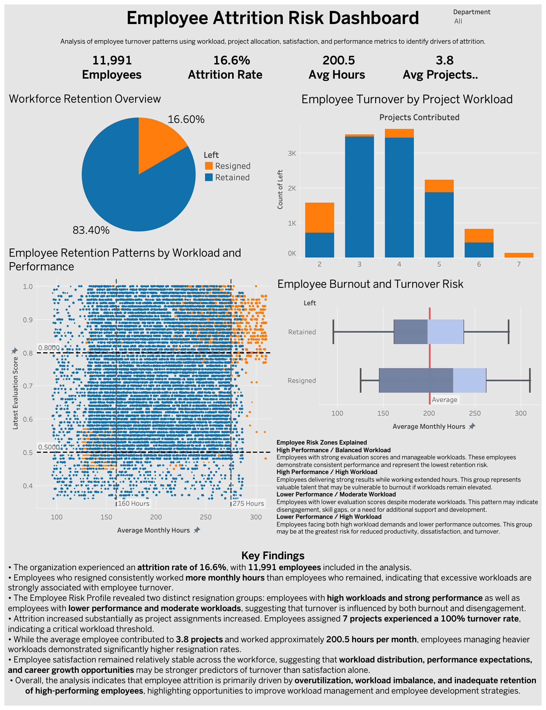

# Employee Attrition Analysis and Predictive Modeling

## Overview

This project analyzes employee attrition patterns using exploratory data analysis, statistical testing, machine learning classification models, and interactive business intelligence dashboards. The goal is to identify workforce behaviors associated with resignation risk and develop predictive models capable of identifying employees likely to leave the organization.

The analysis focuses on workload intensity, employee satisfaction, performance evaluations, tenure, promotion history, department-level trends, and salary levels.

Among the evaluated models, XGBoost achieved the strongest predictive performance and was selected as the final champion model.

---

## Interactive Dashboard

**Tableau Public Dashboard:**

https://public.tableau.com/app/profile/akilan.sureshkumar/viz/hr_employee_attrition_dashboard/EmployeeAttritionRiskDashboard

  

The interactive Tableau dashboard enables users to explore:

* Workforce retention and attrition metrics
* Employee burnout and workload analysis
* Project workload versus turnover trends
* Employee risk profiling using workload and performance metrics
* Key findings and business recommendations
* Interactive department-level filtering

The dashboard was designed to support HR stakeholders in identifying employee groups at elevated risk of attrition and evaluating potential retention strategies.

---

## Business Problem

Employee attrition creates operational and financial challenges through:

* Increased hiring and onboarding costs
* Productivity disruption
* Institutional knowledge loss
* Reduced workforce continuity

Understanding the factors associated with resignation can help organizations improve retention strategies and proactively identify at-risk employees.

---

## Dataset

The dataset used in this project is a simulated HR analytics dataset publicly available on Kaggle.

**Source:**
https://www.kaggle.com/datasets/mfaisalqureshi/hr-analytics-and-job-prediction/data

The dataset contains employee-level information related to:

* Satisfaction level
* Evaluation score
* Project workload
* Monthly hours
* Tenure
* Department
* Salary level
* Promotion history
* Attrition status

### Important Note

This dataset is synthetic/simulated and does not represent real employee records. This project is intended to demonstrate workforce analytics, exploratory analysis, statistical testing, predictive machine learning workflows, and business intelligence reporting in an HR context.

### Dataset Summary

* Approximately 15,000 employee records before cleaning
* 11,991 employee records after duplicate removal and data preparation
* Binary attrition target variable (`left`)
* Moderate class imbalance:

  * 83.4% retained
  * 16.6% resigned

---

## Project Workflow

### 1. Data Cleaning and Preparation

* Removed duplicate records
* Renamed columns for readability
* Encoded categorical variables
* Engineered `mid_tenure` feature
* Prepared training, validation, and testing datasets

---

### 2. Exploratory Data Analysis (EDA)

The EDA phase examined relationships between attrition and:

* Employee satisfaction
* Workload intensity
* Project volume
* Tenure
* Evaluation score
* Promotion history
* Department-level trends

### Project Visualizations

The notebook included in this repository has been uploaded with outputs cleared to improve GitHub performance and portability.

Key visualizations, model evaluation charts, and dashboard screenshots can be found in the `/images` directory.

Notable visualizations include:

* Employee Attrition Rate by Department
* Monthly Hours vs. Attrition Analysis
* Satisfaction Level Distributions
* Mid-Tenure Employee Risk Analysis
* Employee Risk Profile Visualization
* Random Forest Feature Importance
* XGBoost Feature Importance
* Confusion Matrix (Champion Model)
* Interactive Tableau Dashboard

### Key Findings

* The organization experienced an attrition rate of 16.6%.

* Employees who resigned consistently worked more monthly hours than employees who remained, indicating that excessive workloads are strongly associated with employee turnover.

* Attrition increased substantially as project assignments increased. Employees assigned 7 projects experienced a 100% turnover rate, indicating a critical workload threshold.

* Employee risk profiling revealed two primary resignation groups:

  * High-performing employees experiencing heavy workloads and burnout risk
  * Lower-performing employees exhibiting signs of disengagement

* Employees managing heavier workloads demonstrated significantly higher resignation rates despite strong performance evaluations.

* Promotion rates remained relatively low across the workforce, suggesting potential career advancement and retention challenges.

* The findings indicate that employee attrition is primarily driven by workload imbalance, burnout risk, and insufficient retention of high-performing employees.

---

### 3. Statistical Testing

A Welch's t-test was performed to compare satisfaction levels between mid-tenure employees (3–5 years) and all other employees.

Results showed significantly lower satisfaction among mid-tenure employees, supporting the hypothesis that this period represents elevated attrition risk.

---

### 4. Machine Learning Modeling

Three classification models were evaluated:

* Logistic Regression
* Random Forest
* XGBoost

### Modeling Techniques

* Train/validation/test split
* Stratified sampling
* Hyperparameter tuning with GridSearchCV
* Cross-validation
* Feature importance analysis

### Evaluation Metrics

Models were evaluated using:

* Accuracy
* Precision
* Recall
* F1 Score

F1 score was emphasized due to class imbalance.

---

## Model Performance

| Model                | Accuracy | Precision | Recall | F1 Score |
| -------------------- | -------- | --------- | ------ | -------- |
| Logistic Regression  | 73.0%    | 0.35      | 0.75   | 0.48     |
| Random Forest        | 94.6%    | 0.876     | 0.786  | 0.828    |
| XGBoost (Validation) | 96.4%    | 0.919     | 0.857  | 0.887    |
| XGBoost (Final Test) | 94.1%    | 0.868     | 0.761  | 0.811    |

### Final Champion Model

XGBoost was selected as the champion model based on its superior balance of precision, recall, F1 score, and overall classification performance.

---

## Feature Importance Insights

The strongest predictors of attrition included:

* Projects contributed
* Mid-tenure status
* Evaluation score
* Average monthly hours
* Satisfaction level

The results suggest two major attrition patterns:

### High-Performing Burnout Risk

Employees with:

* High workloads
* Multiple project assignments
* Strong evaluation scores

showed elevated resignation risk.

### Mid-Tenure Retention Risk

Employees in the 3–5 year tenure range demonstrated:

* Declining satisfaction
* Increased workload
* Higher resignation frequency

---

## Technologies Used

### Programming & Analysis

* Python
* Pandas
* NumPy
* SciPy

### Visualization

* Tableau
* Matplotlib
* Seaborn

### Machine Learning

* Scikit-learn
* XGBoost

### Model Serialization

* Joblib

---

## Conclusion

This project combined exploratory analysis, statistical testing, machine learning, and interactive business intelligence visualization to identify key drivers of employee attrition.

The analysis revealed that workload intensity, project allocation, employee performance, and mid-tenure career stages were among the strongest indicators of resignation risk. Notably, employees assigned excessive project workloads exhibited substantially higher attrition rates, including a 100% turnover rate among employees assigned seven projects.

The final XGBoost model demonstrated strong predictive performance, while the Tableau dashboard translated analytical findings into actionable business insights that can support workforce planning, employee retention, and organizational decision-making.
